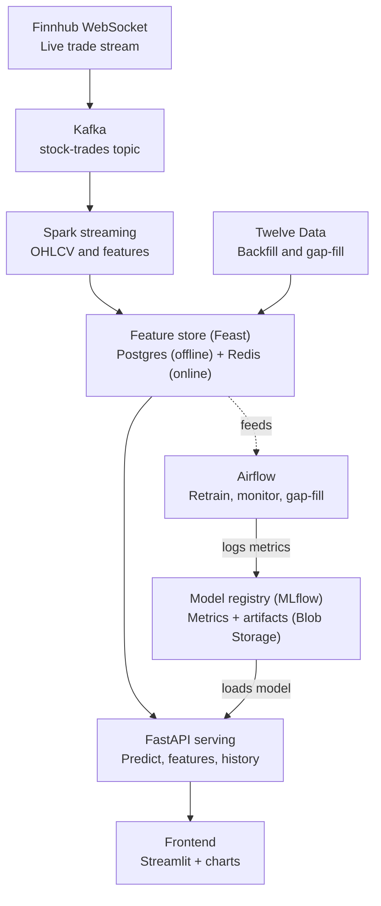

# Stock Price Forecasting Pipeline - Requirements and Design

## 1. Overview

This project implements a real-time stock price forecasting system.

Retail traders and analysts often work with stale or batch-updated data, which makes it difficult to evaluate short-term price movement. This system addresses that gap by ingesting live market data, computing features in real time, and using a regression model to predict the next price point. An increase/decrease signal is derived from the predicted price.

The system consists of four main components: a real-time data ingestion pipeline, a feature store, a forecasting model, and a prediction API.

**Scope**: This project targets a single asset class (equities) and a small set of tickers. It is not designed for trading-grade accuracy or multi-exchange support. The focus is on demonstrating a production-style, real-time feature pipeline feeding a forecasting model.

## 2. Goals / Non-Goals

### 2.1 Goals

- Ingest live market data using a streaming pipeline.
- Serve consistent features for training and inference using a feature store.
- Orchestrate batch retraining and backfills.
- Deploy the system as a containerized, cloud-hosted service.
- Forecast stock price using regression on time-series features.

### 2.2 Non-Goals

- Not optimized for trading-grade prediction accuracy.
- Not designed to support multiple exchanges or asset classes.
- Not built for high availability or horizontal scale.
- Not built to handle all data quality edge cases (e.g., corporate actions, stock splits).

## 3. Users / Use Case

This system is designed around the needs of a retail trader or analyst who wants access to real-time stock data and short-term price forecasts. For this portfolio project, a reviewer acts as the primary user. The reviewer can select a ticker from a dropdown menu to view a live price chart, the forecasted price and direction, and feature importance.

## 4. Functional Requirements

### 4.1 Data Ingestion

Live trade data is ingested via a single Finnhub WebSocket connection, subscribed to all tracked tickers. Ingestion is event-driven; there is no polling interval, since new data arrives as trades occur.

The system tracks five tickers across four sectors: AAPL and TSLA (technology), JPM (financial), JNJ (healthcare), and KO (consumer staples).

Ingestion is checked against a market calendar (e.g., via the `pandas_market_calendars` library) to distinguish regular trading hours and market holidays from an actual data gap.

Historical data for backfill is retrieved from the Twelve Data API's `/time_series` endpoint. This usage is limited to internal, non-display purposes (model training and feature computation); it is not shown directly on the frontend.

### 4.2 Streaming

Trade messages from the Finnhub WebSocket are published to a single Kafka topic (`stock-trades`). Kafka decouples ingestion from downstream processing: the WebSocket consumer only publishes messages, and does not need to know how they are used afterward.

A stream processor consumes messages from this topic, computes rolling features (e.g., moving averages, volatility), per ticker, and writes the results to the feature store. Using Kafka as an intermediary also allows recent messages to be replayed if a processing error is found, without re-fetching data from Finnhub.

### 4.3 Feature Engineering

Features are computed using Spark Structured Streaming, applied to trade messages consumed from the Kafka `stock-trades` topic. Every minute, the following features are computed per symbol from the trades that occurred during the interval.

**Bar aggregation (OHLCV)**

- Open: Price of the first trade in the interval.
- High: Max price across all trades in the interval.
- Low: Minimum price across all trades in the interval.
- Close: Price of the last trade in the interval.
- Volume: Sum of trade volumes across the interval.

If an interval has no trades, Open, High, Low, and Close carry forward the previous interval's Close, and Volume is set to zero.

**Lag features**

- Lag-1 Close: Previous bar's close price.
- Lag-5 Close: Close price from five bars back.
- Lag-15 Close: Close price from fifteen bars back.
- Lag-1 Return: Percent change in close price from the previous bar.

**Rolling statistics**

- 5/15/60 Minute Rolling Mean: Average close price over each window.
- 5/15/60 Minute Rolling Standard Deviation: Standard deviation of 1-bar returns over each window.
- 15/60 Minute Low: Minimum close price over each window.
- 15/60 Minute High: Maximum close price over each window.
- 15 Minute Volume Mean: Average volume over the last 15 minutes.

**Time-of-day features**

- Minutes Since Market Open: Minutes elapsed since market open.
- Day of Week: Day of the week.
- Is Near Open: True if within the first 15 minutes of the session.
- Is Near Close: True if within the last 15 minutes of the session.

**Target variable**

- Next Close: Close price of the following interval. Used as the training label, not as a model input.

### 4.4 Feature Store

There will be two feature stores, an offline Postgres database and an online Redis database, both of which will be managed using Feast. The two databases will have the same schema shown below:

| Feature                   | Type      | Description                                                       | Store            |
| ------------------------- | --------- | ----------------------------------------------------------------- | ---------------- |
| symbol                    | string    | Ticker symbol                                                     | Offline + Online |
| event_timestamp           | timestamp | Time the row is valid as of                                       | Offline only     |
| open                      | float     | Price of the first trade in the interval                          | Offline + Online |
| high                      | float     | Max price across all trades in the interval                       | Offline + Online |
| low                       | float     | Minimum price across all trades in the interval                   | Offline + Online |
| close                     | float     | Price of the last trade in the interval                           | Offline + Online |
| volume                    | integer   | Sum of trade volumes across the interval                          | Offline + Online |
| lag_1_close               | float     | Previous bar's close price                                        | Offline + Online |
| lag_5_close               | float     | Close price from five bars back                                   | Offline + Online |
| lag_15_close              | float     | Close price from fifteen bars back                                | Offline + Online |
| lag_1_return              | float     | Percent change in close price from previous bar as a percentage   | Offline + Online |
| close_rolling_mean_5min   | float     | Average close price over the last five minutes                    | Offline + Online |
| close_rolling_mean_15min  | float     | Average close price over the last fifteen minutes                 | Offline + Online |
| close_rolling_mean_60min  | float     | Average close price over the last hour                            | Offline + Online |
| return_rolling_std_5min   | float     | Standard deviation of 1-bar returns over the last five minutes    | Offline + Online |
| return_rolling_std_15min  | float     | Standard deviation of 1-bar returns over the last fifteen minutes | Offline + Online |
| return_rolling_std_60min  | float     | Standard deviation of 1-bar returns over the last hour            | Offline + Online |
| low_15min                 | float     | Minimum close price over the last fifteen minutes                 | Offline + Online |
| low_60min                 | float     | Minimum close price over the last hour                            | Offline + Online |
| high_15min                | float     | Maximum close price over the last fifteen minutes                 | Offline + Online |
| high_60min                | float     | Maximum close price over the last hour                            | Offline + Online |
| volume_mean_15min         | float     | Average volume over the last fifteen minutes                      | Offline + Online |
| minutes_since_market_open | integer   | Minutes elapsed since market open                                 | Offline + Online |
| day_of_week               | string    | Day of the week                                                   | Offline + Online |
| is_near_open              | boolean   | True if within the first 15 minutes of the session                | Offline + Online |
| is_near_close             | boolean   | True if within the last 15 minutes of the session                 | Offline + Online |
| next_close                | float     | Close price of the following interval (target variable)           | Offline only     |

During zero-trade intervals, open, high, low, and close are set to whatever close was in the previous bar, and volume is set to 0. The schema is intentionally denormalized to optimize serving latency by having precomputed rolling and lag features.

### 4.5 Model

The system predicts a stock's close price for the next interval using regression on engineered features (see section 4.3). The model is retrained daily, with additional retraining triggered by a performance monitoring check (section 4.8). See section 9 for model selection, feature inputs, and evaluation details

### 4.6 Serving

The prediction service exposes the following REST endpoints via FastAPI:

| Method | Path                 | Description                                             | Request                                                                                                                      |
| ------ | -------------------- | ------------------------------------------------------- | ---------------------------------------------------------------------------------------------------------------------------- |
| GET    | `/predict/{symbol}`  | Returns the latest prediction for a ticker              | Path param: `symbol` (string)                                                                                                |
| GET    | `/features/{symbol}` | Returns the current feature values for a ticker         | Path param: `symbol` (string)                                                                                                |
| GET    | `/history/{symbol}`  | Returns historical bars for charting from offline store | Path param: `symbol` (string); query params: `start`, `end` (ISO timestamps), `resolution` (`1min`, `5min`, `1hour`, `1day`) |
| GET    | `/health`            | Returns pipeline/service health status                  | None                                                                                                                         |

**Example responses:**

`GET /predict/{symbol}`

```json
{
  "symbol": "AAPL",
  "predicted_next_close": 231.45,
  "current_close": 229.8,
  "direction": "increase",
  "percent_change": 0.0072,
  "shap_values": {
    "lag_1_close": 0.31,
    "close_rolling_mean_5min": 0.18,
    "volume_mean_15min": -0.04
  },
  "timestamp": "2026-09-14T14:32:00Z"
}
```

`GET /features/{symbol}`

```json
{
  "symbol": "AAPL",
  "event_timestamp": "2026-09-14T14:32:00Z",
  "open": 229.5,
  "high": 229.85,
  "low": 229.4,
  "close": 229.8,
  "volume": 184320,
  "lag_1_close": 229.65,
  "lag_5_close": 229.1,
  "lag_15_close": 228.75,
  "lag_1_return": 0.0007,
  "close_rolling_mean_5min": 229.58,
  "close_rolling_mean_15min": 229.2,
  "close_rolling_mean_60min": 228.4,
  "return_rolling_std_5min": 0.0009,
  "return_rolling_std_15min": 0.0014,
  "return_rolling_std_60min": 0.0021,
  "low_15min": 228.9,
  "low_60min": 227.8,
  "high_15min": 229.85,
  "high_60min": 229.85,
  "volume_mean_15min": 162500,
  "minutes_since_market_open": 245,
  "day_of_week": "Monday",
  "is_near_open": false,
  "is_near_close": false
}
```

`GET /history/{symbol}?start=2026-09-14T09:30:00Z&end=2026-09-14T09:35:00Z&resolution=1min`

```json
[
  {
    "timestamp": "2026-09-14T09:30:00Z",
    "open": 228.1,
    "high": 228.4,
    "low": 228.05,
    "close": 228.3,
    "volume": 95200
  },
  {
    "timestamp": "2026-09-14T09:31:00Z",
    "open": 228.3,
    "high": 228.55,
    "low": 228.2,
    "close": 228.5,
    "volume": 87400
  },
  {
    "timestamp": "2026-09-14T09:32:00Z",
    "open": 228.5,
    "high": 228.6,
    "low": 228.35,
    "close": 228.45,
    "volume": 76100
  }
]
```

`GET /health`

```json
{
  "status": "ok",
  "websocket_connected": true,
  "last_trade_received": "2026-09-14T14:31:58Z"
}
```

Error responses are handled as follows:

| Status | Meaning                                            |
| ------ | -------------------------------------------------- |
| 400    | Missing or invalid query parameters                |
| 404    | Symbol is not tracked by this service              |
| 503    | No prediction available yet, or live data is stale |
| 500    | Unexpected server error                            |

A valid symbol with no data in the requested range returns `200` with 
an empty array, rather than an error.

### 4.7 Frontend

The frontend has a dropdown menu where the user selects a ticker to view. After selecting a ticker, a candlestick chart of historical data is displayed using `streamlit-lightweight-charts-pro`, with options to view the past hour (1min resolution), day (5min resolution), week (1hour resolution), or month (1day resolution). Below the chart, a prediction panel shows the predicted direction (increase/decrease), predicted next close price, percent change, and relevant SHAP values. A connection status indicator based on the `/health` endpoint, shows whether the live data feed is currently connected.

Data is refreshed based on the active view. The prediction panel and connection status are polled every 5-10 seconds. The hour view is polled every 5-10 seconds, appending new bars as they arrive. The day view is polled every 1-2 minutes, or refetched when the tab is selected. The week and month views fetch once, when their tab is selected.

### 4.8 Orchestration

Airflow orchestrates the following workflows:

**Daily retraining DAG**: Pulls accumulated features from the offline store and retrains the selected model (chosen during initial development) on the latest data. Evaluates the retrained model against a holdout set and deploys it if evaluation passes. Runs on a daily schedule after market close, and can also be triggered on demand by the performance monitoring DAG.

**Performance monitoring DAG**: Runs on a shorter interval than daily retraining, evaluating recent live prediction accuracy (MAPE) against a threshold. If performance drops below the threshold, it triggers an out-of-schedule run of the retraining DAG.

**Gap-fill DAG**: Triggered when the ingestion pipeline detects a gap in live data. Pulls the missing time window from Twelve Data and writes it into the offline and online stores.

The initial historical backfill is a one-time bootstrap step, run manually rather than as a recurring DAG. Comparison across candidate algorithms (ElasticNet, CatBoost, XGBoost, LightGBM) also happens once, during initial development; the daily retraining DAG retrains only the selected algorithm thereafter.

### 4.9 Deployment

Each service is containerized with Docker and deployed to Azure Container Apps: the Finnhub WebSocket ingestion consumer, the Spark stream processor, the FastAPI serving layer, the Airflow scheduler and workers, and the Streamlit frontend. In production, supporting infrastructure uses managed Azure services (Event Hubs, Azure Database for PostgreSQL, Azure Cache for Redis; see section 8). For local development, the equivalent self-hosted services (Kafka, Postgres, Redis) run via `docker-compose`, giving a faster iteration loop and avoiding any Event Hubs compatibility issues during development. Secrets are kept in Azure Key Vault in both environments.

Each service has its own container image, built and pushed to a container registry (Azure Container Registry), and deployed independently to Azure Container Apps. This allows each component to scale and be redeployed separately without affecting the others.

Code changes are validated and deployed via a CI/CD pipeline (GitHub Actions): tests run on every push, and on merge to main, container images are built and pushed to Azure Container Registry, then deployed to Azure Container Apps.

## 5. Non-Functional Requirements

**Data freshness**: Features are expected to be available in the online store within 15 seconds of bar close. A feature timestamp older than 2 minutes is treated as stale and reflected in system health status (see `/health`, section 4.6).

**Latency**: The `/predict/{symbol}` and `/features/{symbol}` endpoints respond within 500ms under normal (warm) operation. The serving API may scale to zero when idle to reduce cost; a cold start may add several seconds of one-time latency to the first request after a period of inactivity.

**Reliability**: If the Finnhub WebSocket connection drops, the system degrades gracefully rather than displaying stale data as if it were live: the frontend shows a disconnected state, and a gap-fill DAG backfills the missing window from Twelve Data once the connection is restored (see section 4.8).

**Scalability**: Out of scope. The system is designed for a fixed set of five tickers and is not built to handle additional symbols, higher message volume, or concurrent users at production scale.

**Data quality**: The system does not handle all data quality edge cases (e.g., corporate actions, stock splits). Zero-trade intervals are handled by carrying forward the previous close (see section 4.3).

## 6. Architecture



| Component               | Responsibility                                                                                           |
| ----------------------- | -------------------------------------------------------------------------------------------------------- |
| Finnhub WebSocket       | Streams live trades for the five tracked tickers over a single connection                                |
| Kafka                   | Decouples ingestion from processing; buffers trade messages on the `stock-trades` topic                  |
| Spark Streaming         | Aggregates trades into 1-minute OHLCV bars and computes lag/rolling/time-of-day features                 |
| Twelve Data             | Provides historical OHLCV data for initial backfill and gap-filling after outages                        |
| Feature store (Feast)   | Stores features in Postgres (offline) and Redis (online), keeps training and serving features consistent |
| Airflow                 | Orchestrates daily retraining, performance monitoring, and gap-fill DAGs                                 |
| Model registry (MLflow) | Tracks retraining metrics and stores trained model artifacts in Blob Storage                             |
| FastAPI serving         | Exposes `/predict`, `/features`, `/history`, and `/health`; loads the current model from the registry.   |
| Frontend                | Displays the candlestick chart and prediction panel; polls the serving API at view-appropriate intervals |

## 7. Data

**Sources**: Finnhub (WebSocket, live trades) and Twelve Data (`/time_series`, historical backfill). See section 4.1 for ingestion details and licensing scope.

**Raw schema**: Individual trade messages (symbol, price, volume, timestamp) from Finnhub.

**Feature schema**: See section 4.4 for the full feature store schema.

## 8. Tech Stack

| Layer                  | Tool                                                                                      | Why                                                                                                                                           |
| ---------------------- | ----------------------------------------------------------------------------------------- | --------------------------------------------------------------------------------------------------------------------------------------------- |
| Live ingestion         | Finnhub WebSocket API                                                                     | Real-time trade data, no polling required                                                                                                     |
| Historical backfill    | Twelve Data API                                                                           | Historical OHLCV for backfill and gap-filling                                                                                                 |
| Message queue          | Azure Event Hubs (Kafka-compatible)                                                       | Decouples ingestion from processing; buffers and replays trade messages, managed                                                              |
| Stream processing      | Spark Structured Streaming                                                                | Aggregates trades into OHLCV bars and computes features                                                                                       |
| Feature store          | Feast                                                                                     | Ensures consistent features across training and serving                                                                                       |
| Offline store          | Azure Database for PostgreSQL                                                             | Historical feature data for training, managed                                                                                                 |
| Online store           | Azure Cache for Redis                                                                     | Low-latency feature lookups for serving, managed                                                                                              |
| Model                  | Candidates: ElasticNet regression, CatBoost, XGBoost, LightGBM (best of, by holdout MAPE) | Compares a simple linear baseline against gradient-boosted regression on tabular features; final choice determined during initial development |
| Experiment tracking    | MLflow                                                                                    | Tracks retraining metrics and model versions                                                                                                  |
| Model artifact storage | Azure Blob Storage                                                                        | Stores trained model files                                                                                                                    |
| Orchestration          | Apache Airflow                                                                            | Schedules retraining, monitoring, and gap-fill DAGs                                                                                           |
| Serving API            | FastAPI                                                                                   | Exposes prediction, feature, and history endpoints                                                                                            |
| Frontend               | Streamlit + `streamlit-lightweight-charts-pro`                                            | Candlestick chart and prediction display                                                                                                      |
| Market calendar        | `pandas_market_calendars`                                                                 | Distinguishes market holidays from real data gaps                                                                                             |
| Containerization       | Docker                                                                                    | Packages each service independently                                                                                                           |
| Container registry     | Azure Container Registry                                                                  | Stores built container images                                                                                                                 |
| Deployment             | Azure Container Apps                                                                      | Hosts each containerized service                                                                                                              |
| Secrets management     | Azure Key Vault                                                                           | Stores API keys and database credentials                                                                                                      |
| CI/CD                  | GitHub Actions                                                                            | Tests, builds, and deploys on merge                                                                                                           |

## 9. Model Details

Candidate algorithms (ElasticNet, CatBoost, XGBoost, and LightGBM) are compared during initial development; the best-performing algorithm by holdout MAPE is selected for ongoing use.

The target variable is `next_close`, the close price of the next interval. The model is given every feature in the schema (section 4.4) except `event_timestamp` and `next_close`: `event_timestamp` is not predictive, and `next_close` is the label being predicted.

MAPE is the primary evaluation metric, with RMSE as a secondary metric. Both are compared against two naive baselines: a persistence baseline (`next_close = close`) and a lag-1 persistence baseline (`next_close = close + (close - lag_1_close)`).

Direction is derived by subtracting the current `close` price from the predicted `next_close` price. A positive difference indicates an expected price increase, a negative difference indicates an expected decrease, and a difference of zero indicates no expected change.

SHAP values are computed for each prediction to show which features contributed most to it. These are returned alongside the prediction (see `/predict/{symbol}`, section 4.6) and displayed in the frontend's prediction panel (section 4.7).

The model is retrained daily after market close. Retraining is also triggered if evaluation performance (MAPE against a holdout set) drops below a threshold, to be determined during initial model evaluation.

## 10. Success Metrics

### 10.1 Pipeline

- Data freshness: features available in the online store within fifteen seconds of bar close (section 5).
- Ingestion uptime: WebSocket connection stays active during market hours, with gaps detected and backfilled automatically.

### 10.2 Model

- The selected model (section 9) outperforms both naive baselines (persistence and lag-1 persistence) on holdout MAPE.
- Directional accuracy exceeds a coin-flip baseline (50%) on holdout data.

### 10.3 Demo

- End-to-end latency from ticker selection to displayed prediction is under 1 second under normal (warm) operation; a cold start may add several seconds on the first request after a period of inactivity (see section 5).
- The frontend accurately reflects pipeline health (connected/stale) during a simulated or real WebSocket disconnect.

## 11. Milestones / Build Order

1. **Backfill and ingestion**: Twelve Data historical backfill; Finnhub WebSocket ingestion into Kafka (local) / Event Hubs (production).
2. **Stream processing**: Spark Structured Streaming aggregates trades into OHLCV bars and computes features (section 4.3).
3. **Feature store**: Feast configured with Postgres (offline) and Redis (online) stores.
4. **Model development**: candidate algorithms (ElasticNet, CatBoost, XGBoost, LightGBM) trained and evaluated against naive baselines; best performer selected.
5. **Serving**: FastAPI endpoints (`/predict`, `/features`, `/history`, `/health`).
6. **Orchestration**: Airflow DAGs for daily retraining, performance monitoring, and gap-filling.
7. **Frontend**: Streamlit app with candlestick chart and predictions panel.
8. **Deployment**: Dockerize each service; deploy to Azure Container Apps via CI/CD (GitHub Actions).
9. **Monitoring and polish**: alerting, README, demo polish

## 12. Risks / Open Questions

- Retraining performance threshold (section 4.8, section 9) is not yet 
  set; to be determined during initial model evaluation.
- Spark Structured Streaming's Kafka connector has not yet been 
  validated against Azure Event Hubs' Kafka-compatible endpoint; if 
  incompatible, Kafka may need to be self-hosted in production instead 
  of using Event Hubs.
- Twelve Data's licensing terms for displaying data (as opposed to 
  internal/non-display use) have not been fully confirmed; relevant if 
  backfilled data is ever surfaced on the frontend.
- Twelve Data's available backfill depth for intraday history has not 
  been confirmed; may constrain how much historical training data is 
  available at project start.
